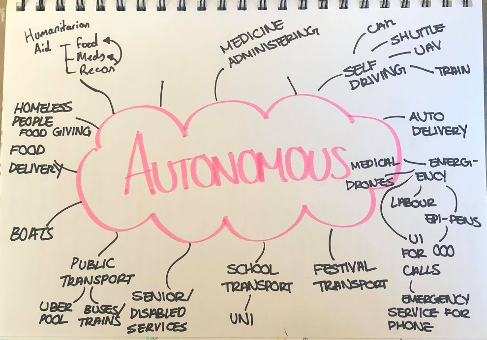
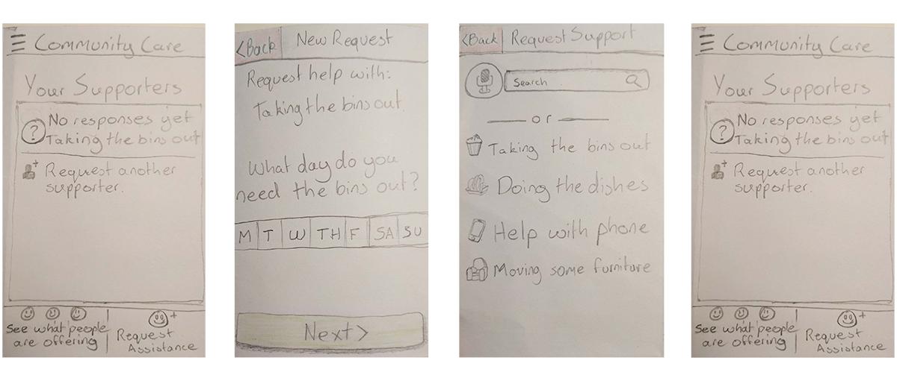
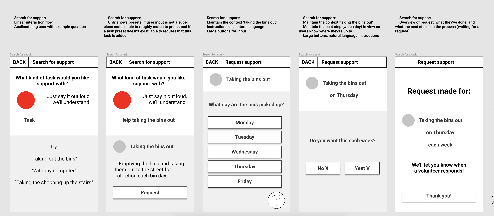
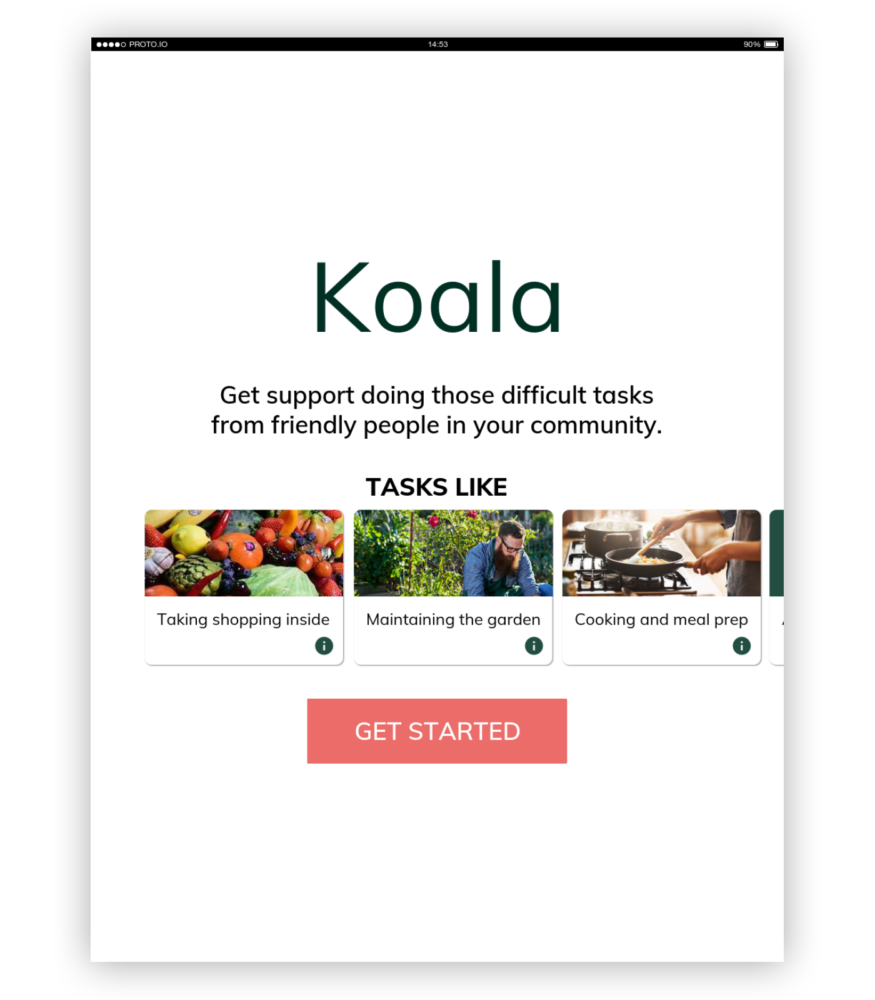
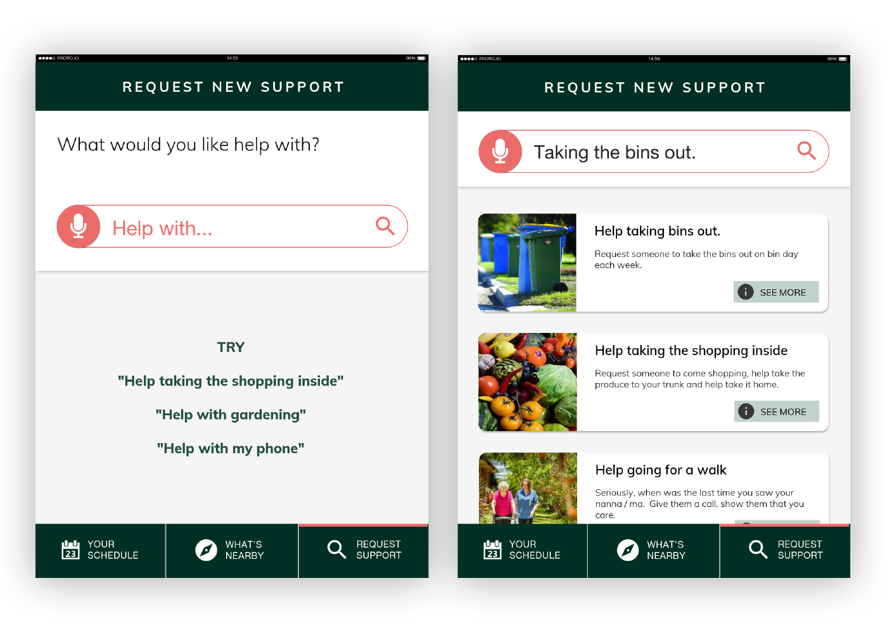
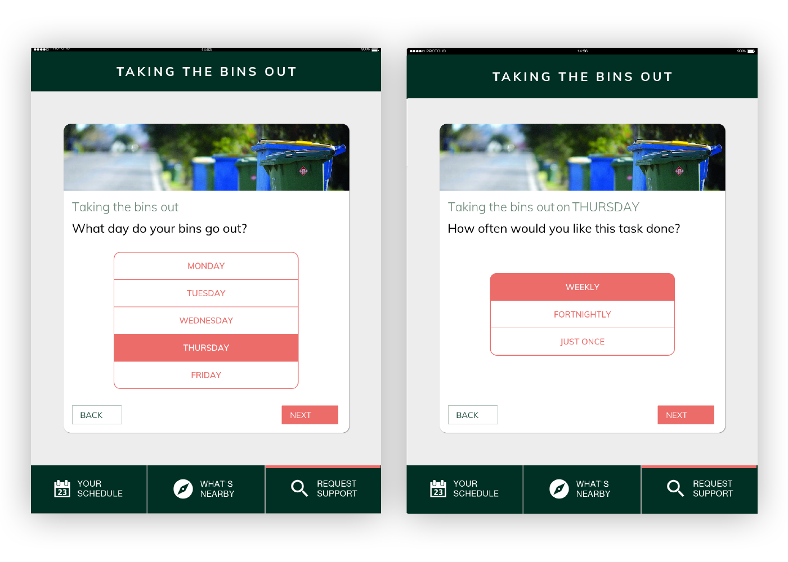
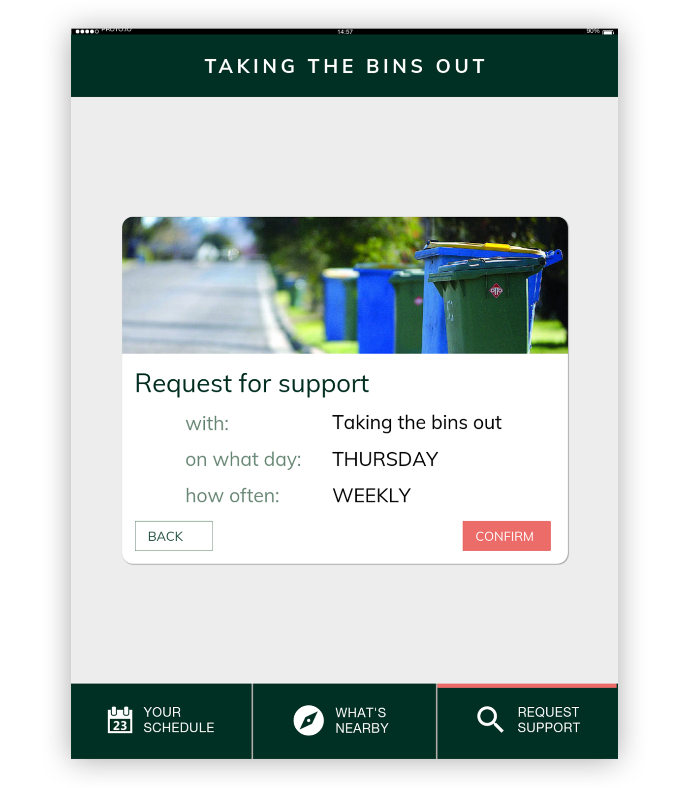

---
{
  "title": "Koala & Joey",
  "shortdescription": "Aged care sucks.  User focused design project to optimise the aged care industry and promote active aging.",
  "date": "2018-11-15",
  "image": "/koalajoey-glamour.png",
  "video": "/koalajoey-showcase.mp4",
  "team": [
    { "name": "Soomin Lee", "link": "https://www.behance.net/soomin3375cb4" }
  ],
  "tools": ["hand sketching", "proto.io", "sketch", "invision"],
  "methods": ["observatory research", "surveys", "user journey mapping", "user interviews", "focus groups"],
  "myrole": [
    { "name" : "User based problem area analysis", "link": "" },
    { "name" : "Analysing user research", "link": "" },
    { "name" : "Interface design", "link":"" },
    { "name" : "User testing and eliciting feedback", "link": "" },
    { "name" : "Developing prototypes from feedback", "link":"" }
  ],
  "duration": "3 months",
  "description": "Aged care sucks.  With a royal commission currently being conducted into the level of care on   top of exorbitant costs for the government and the individual, the industry was due for a reboot. Koala & Joey are two apps design to eliviate some of these issues, by enabling volunteers to easily get involved senior citizens in need.",
  "tags": ["UX/UI Design"],
}
---
## 1. Brief & Objective

Koala and Joey was the outcome of Interface Design Studio, a formative subject of the Bachelor of Computing Design at the University of Sydney.  We were tasked with devloping a solution, in a problem area of our choice, employing autonomous vehicles and some form of digital interface.  

> With AVs poised to reshape society we wanted to find an application for autonomous vehicles to solve a societal problem.  

After exploring autonomous vehicles' application to disaster releif, public transport and humanitarian services we decided to focus on solving **problems faced by senior citizens**.  With an aging population and an archaic, insufficient aged care system, we beleived this topic **had the greatest potential for an effective solution**. 

## 2. So, what sucks when you're old?

As a team we conducted 6 semi-structured interviews with senior citizens at a local retirement village.  On top of notes taken during the interview, the recordings were transcribed for later analysis.  This was followed by a further 8 observational studies on the way senior citizens use public transport.

We analysed the records in an affinity diagram finding a range of issues from hearing loss to loneliness to money anxieties. 
However, two discoveries stood out most to me.

> 1. Senior citizens struggled most with the short and infrequent tasks, such as shopping and taking the bins out.
> 2. Senior citizens spoke about aged care as something they'd regretfully have to submit to.

Which got me thinking, **how can we use autonomous vehicles to address the first point and prolong the time before the second becomes necessity**.

## 3. How can we make it suck less

Because loneliness was by far the most prevalent issue we recorded, we wanted to use autonomous vehicles in a way that promotes human to human interaction.

With these two concepts in mind, we landed on the idea of using autonomous vehicles to promote short bouts of volunteering in those key areas.  
> Our goal was to improve the livelihood of the elderly, but now how can we benefit the volunteers?

To understand volunteers goals, needs and fears we conducted a focus group with 6 students who had experience volunteering in different sectors.
We heard 

If we could provide a better volunteering experience that results in much needed support being provided to senior citizens without aged care plans then we had a concept. 

Because of variations in the way each demographic uses (and owns) technology, we identified we'd need two UIs.  My group member, Soomin, was to develop a smartphone app interface for volunteers and I a tablet interface for senior citizens.

## 4. Early prototypes and testing

I developed a number of pen and paper wireframes that, with feedback from my tutor and Soomin evolved into a lofi prototype. 

These prototypes were made interactive using [Pop](https://marvelapp.com/pop/) before being taken back to the retirement village and tested on 4 sydney siding senior citizens.

### Here's what we found:

> 1. Text input is fiddly and tedious, instead opt for valuable but generic defaults
> 2. Reduce the amount of interactive elements, senior citizens are not as used to parallel processing of text as us. 
> 3. Additionally, a linear ui flow reduces information overload.
> 4. With eyesight degredation, large bold text is key for legibility.
> 5. Provide context to the users actions and inform them of what will happen next, even if it means long instructive text.

## 5. Hi fidelity wireframes

These insights were realised by breaking each tasks into a 'quantified ui', where each screen has a single purpose; using voice input to provide alternate inputs for text boxes and adding context to each screen of how complete the task is.

## 6. Final Product 
#### Login/signup page showing users the potential tasks they can receive help with

#### Task search page, showing voice recogniton capabilities and the list UI

#### Task request page showing how users can specify their needs with tasks they need support with

#### Confirmation page allowing users to double check the information they've entered is correct

