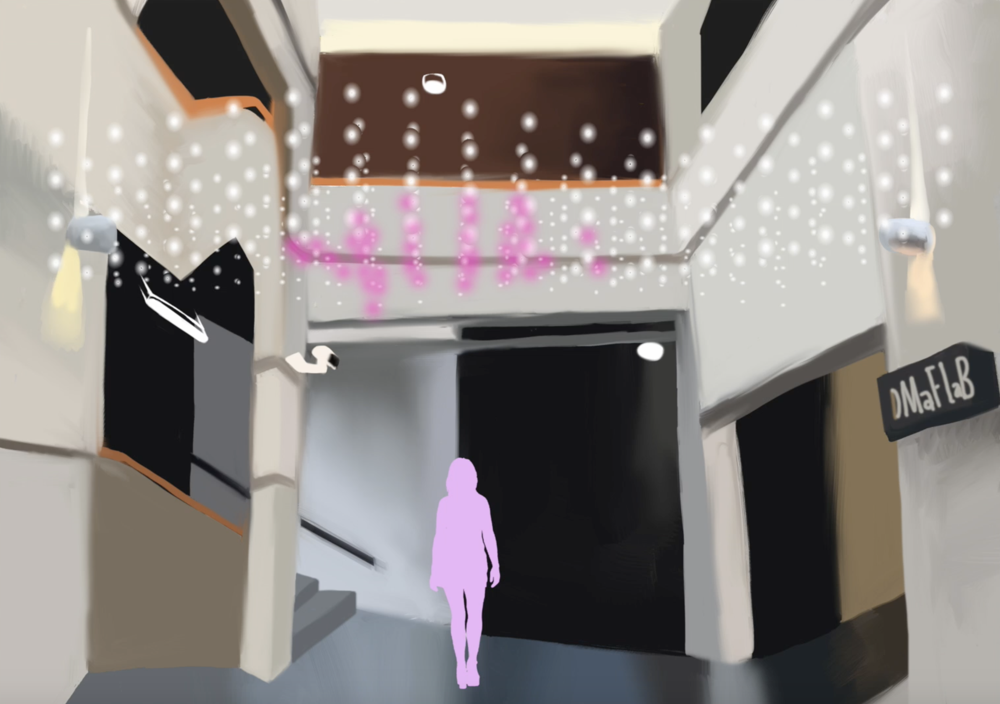

---
{
  "title": "Presence",
  "shortdescription": "Interactive lighting display built as a result of winning a designathon at the University of Sydney.",
  "date": "2018-05-10",
  "video": "/presence-showcase.mp4",
  "team": [
    { "name": "Soomin Lee", "link": "https://au.linkedin.com/in/soominleedesign", },
    { "name": "Jessica Amy Fernandez", "link": "https://www.linkedin.com/in/jessica-amy-fernandez", },
    { "name": "Keegan Haugh", "link": "https://www.linkedin.com/in/keeganhaugh", }
  ],
  "tools": ["openFrameworks", "openCV", "Raspberry Pi", "Open Lighting Architecture", "DMX512", "e1.31", "glsl/shader programming", "openGL"],
  "myrole": [
    { "name" : "Concept generation", "link": "" },
    { "name" : "Project Planning", "link":"" },
    { "name" : "Designing the Technical Implementation", "link":"" },
    { "name" : "Design and Development", "link": "" },
    { "name" : "Building and Installing", "link": "" },
  ],
  "duration": "1 month for first prototype, fixed up over the next year",
  "description": "During the mid-year break at the University of Sydney a designathon was held by the SUEDE society to build a new light sculpture for the Wilkinson building's centenial.  Here we pitched a concept to track passersby movements across the foyer of the building and render blobs of light above their head in an LED array, representing the passed student and professor designers who have used this building over the last 100 years."
}
---

## Showcase

## Pitch

The designathon went from 9 in the morning to 5 at night giving us a short window to generate, develop and plan the execution of our ideas.  The brief was to create a moment of reflection in passersby and had to reference the Wilkinson building centenial in some way.  

We wanted to connect current students and professors of the building to the inhabitants of its past by rendering blobs of light that danced around users overhead.  We developed our slides for our pitch, concept art and an interactive mockup of what the experience would be like.

I was responsible for the concept generation and the development of the interactive mockup as well as partially responsible for the pitch and technical analysis.

###### Concept art of the final design by Jessica Amy Fernandez

## Technical Implementation

We began by exploring hardware options.  I reached out to a user on the openFrameworks community slack asking if he had experience with lighting displays.  He passed me on to a friend who recommended [Advatek's](https://www.advateklights.com/) lighting controllers.  We additionally planned on running the display on a [Raspberry Pi 3B+](https://www.raspberrypi.org/) and he expressed concern over its computing power.  These concerns proved to be sound later on.

I began researching the best way to track passersby via an overhead webcam.  I used the excellent [ofxCv](https://github.com/kylemcdonald/ofxCv) addon for openFrameworks that provided handy wrappers for many of computer vision library openCV's functions as well as exposed the c++ API.  The implementation we initially landed upon was to use dense optical flow to build a heat map of movement and then run the heatmap through a countours finder to generate individual shapes representing each user that we could use to render a light above their head.

This proved to be incredibly slow as it required complex calculations on every pixel of the image and as a result the display had to be run on my personal computer until I could refactor the logic.

I constructed the rendered scene by rendering each spirit and then mixing it with a background shader to create metaballs.  The rendering of the display itself was done to a frame buffer object which was mapped to the lighting display and passed to [Open Lighting Architecture](https://www.openlighting.org/ola/) which manages sending it to the lighting controller

Jessica and Keegan were hugely helpful with the construction and installation of the display, we ran cables across the space and zip-tied the LED strands to them.  The webcam to track passersby was mounted on the roof in the corner of the foyer cables ran down the sides of the wall to the controller which was mounted on bolts. 

## Problems faced

After the display had been up for a while I had identified some areas for improvement.  Mainly, the sense of reactivity in the display was weak, this was due to a slow response time of the position tracking as well as lack of contrast between the foreground and background on the LED array.  The responsiveness was a result of the slow motion detection algorithm which, after being run through perftools showed was it was using up roughly 90% of the process time.

## The re-design

To address the responsiveness issue I re-wrote the computer vision part of the application to instead compare each frame from the webcam to a learned-image of the background, find the differences between them and running it through a countour finder to track each difference-blob.  This whole process was then run on its own thread to ensure that the rendering could maintain a steady framerate.

To address the contrast issue we did away with the softly edged blobs that rendered above the user, instead opting for block colors and squares.  Additionally, we added a new interaction that let users leave a growing trail of whatever color they were assigned behind them and, if the trail grew to envelope the LED array, would set the background to be the same color.

The result was a clear and punchy installation that ran at the maximum fps on a raspberry pi.